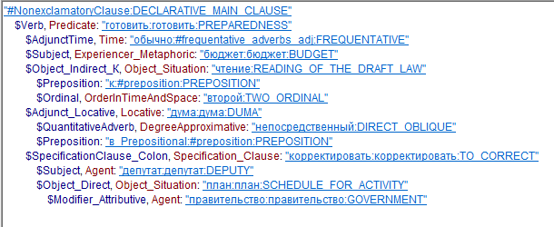
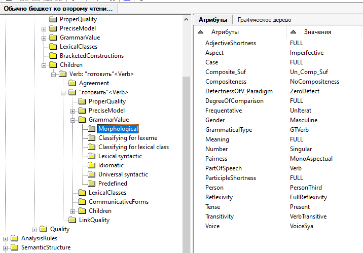

# Содержание
1. [Корпус](#Корпус)
2. [Разметка корпуса](#разметка-корпуса)
3. [Конвертация разметки Compreno в формат UD](#конвертация-разметки-Compreno-в-формат-UD)<br />
3.1 [Токенизация](#Токенизация)<br />
3.2 [Конвертация частей речи и грамматических характеристик](#конвертация-частей-речи-и-грамматических-характеристик)<br />
3.3 [Конвертация синтаксических вершин](#конвертация-синтаксических-вершин)<br />
3.4 [Конвертация зависимых](#конвертация-зависимых)<br />
4. [Основные возникающие проблемы и принятые решения](#основные-возникающие-проблемы-и-принятые-решения)

# Корпус
Корпус включает новостные тексты из [датасета NewsRu.Com](https://abbyyihq-my.sharepoint.com/:u:/g/personal/vladimir_dobrovolskiy_abbyy_com/EfDkvviTivNCjWVkL7WhfeIBSnZdz0yRhssDbGOjHm2kpA?e=CiDK8x), полученного в процессе создания корпуса с кореферентной разметкой [RuCoCo](https://github.com/vdobrovolskii/rucoco).

Объем корпуса SeMarkup составляет ~400 000 токенов, из которых:

- ~360 000 &ndash; обучающая + валидационная выборка,
- ~40 000 &ndash; эталонная выборка для оценки качества.

Итоговый корпус содержит 3 уровня разметки:

- морфологическую,
- синтаксическую,
- семантическую.

В качестве формата представления разметки выбран формат UD как наиболее распространенный, однако данный формат не содержит семантическую информацию. Полную семантическую разметку предлагает формат Compreno, где указываются как значения слов (при каждом слове указывается семантический класс (СК), семантическое поле, к которому слово относится в данном значении), так и семантические связи между ними (называемые глубинными позициями (ГП)).

Чтобы получить корпус в UD формате, дополненном семантической разметкой, работа была построена следующим образом.


# Разметка корпуса
На первом этапе корпус размечался семантической разметкой Compreno: разметка была получена автоматически с помощью одноименного парсера, после чего проверена вручную. Однако полный вариант разметки содержит достаточно много категорий: более 200 000 семантических классов и более 330 глубинных позиций, что представляется избыточным как для обучения семантических парсеров на имеющемся объеме данных, так и для ряда других задач с использованием корпуса.

Для упрощения данного формализма решено было использовать обобщенные семантические классы &ndash; классы-гиперонимы, а также глубинные позиции с обобщенной семантикой. Так, в обобщенном варианте разметки все лексемы с семантикой движения попадают в класс-гиперонм `MOTION`, а все лексемы, называющие людей, &ndash; в СК `HUMAN`.

Аналогичным образом, сократили и количество глубинных позиций: например, в Compreno есть отдельные позиции для разных характеристик (по весу, скорости, размеру и т.д.) &ndash; в обобщенном варианте характеристики попадают в общую ГП; в Compreno есть разные позиции для темпоральных зависимых &ndash; Time (“вчера, через 2 дня”), Time\_Situation (“когда все приедут”), Time\_Being (“при Иване Грозном”), в упрощенном же формате &ndash; одна общая ГП `Time`.

В результате количество СК-гиперонимов, используемых в разметке, сокращено до **1085** СК, а количество ГП &ndash; до **143** позиций.

В числе выложенных данных:

- полный [список используемых в разметке глубинных позиций](https://github.com/dialogue-evaluation/SEMarkup-2023/blob/main/tagsets/semantic_slots.xlsx) с комментариями и примерами;
- [таблица соответствий лексем их классам-гиперонимам](https://github.com/dialogue-evaluation/SEMarkup-2023/blob/main/tagsets/semantic_classes.csv).

# Конвертация разметки Compreno в формат UD

Разметка Compreno имеет скобочный формат, непосредственно в разметке указываются границы составляющих, семантические классы всех токенов и их  глубинные позиции:

>Обычно бюджет ко второму чтению готовится непосредственно в Думе: депутаты корректируют правительственные планы.


>[[Time: Обычно"обычно:#frequentative\_adverbs\_adj:FREQUENTATIVE"] [Experiencer\_Metaphoric: бюджет"бюджет:бюджет:BUDGET"] [[ко"к:#preposition:PREPOSITION"] [OrderInTimeAndSpace: второму"второй:TWO\_ORDINAL"] Object\_Situation: чтению "чтение:READING\_OF\_THE\_DRAFT\_LAW"] Predicate: готовится"готовить:готовить:PREPAREDNESS" [[DegreeApproximative: непосредственно"непосредственный:DIRECT\_OBLIQUE"] [в"в\_Prepositional:#preposition:PREPOSITION"] Locative: Думе"дума:дума:DUMA"]#: [[Agent: депутаты"депутат:депутат:DEPUTY"] Specification\_Clause: корректируют"корректировать:корректировать:TO\_CORRECT" [[Agent: правительственные"правительство:правительство:GOVERNMENT"] Object\_Situation: планы"план:план:SCHEDULE\_FOR\_ACTIVITY"]]].

Разметка может также быть дополнена поверхностными (синтаксическими) позициями, кореференцией и недревесными синтаксическими связями, однако целью данного корпуса была только семантическая разметка. В итоговый корпус включались только поверхностные позиции, связанные с перемещением составляющих. Они обозначены в разметке как $Dislocation.

Скобочный формат, в отличие от UD, не позволяет указывать в разметке морфологическую информацию &ndash; части речи и грамматические признаки. Тем не менее, эта информация доступна: для размеченного предложения парсер строит дерево разбора, в котором при каждом узле содержится полная грамматическая и семантическая информация: морфологические и синтаксические признаки (граммемы), синтаксические и семантические отношения (позиции), семантические классы, недревесные связи и др.:



Для примера, раскроем морфологические граммемы при узле `"готовить:готовить:PREPAREDNESS"`:



При конвертации разметки в UD недостающая в разметке информация берется из деревьев, после чего разметка преобразуется в формат UD:

```
# text = На месте погибли 25 &ndash; летний Тато Карепов , 43 &ndash; летняя Наталья Карепова и 60 &ndash; летняя Шура Таанани.
1	На	на	ADP	_	_	2	case	_	PREPOSITION
2	месте	место	NOUN	_	Animacy=Inan|Case=Loc|Gender=Neut|Number=Sing	3	obl	Locative	PLACE
3	погибли	погибнуть	VERB	_	Aspect=Perf|Mood=Ind|Number=Plur|Tense=Past|VerbForm=Fin|Voice=Act	0	root	Predicate	PHYSICAL_PSYCHIC_CONDITION
4	25-летний	25-летний	ADJ	_	Case=Nom|Degree=Pos|Gender=Masc|Number=Sing	5	amod	Time	UNIT_OF_TIME
5	Тато	Тато	PROPN	_	Animacy=Anim|Case=Nom|Gender=Fem|Number=Sing	3	nsubj	Experiencer	BEING
6	Карепов	Карепов	PROPN	_	Animacy=Anim|Case=Nom|Gender=Fem|Number=Sing	5	flat:name	Name_Title	BEING
7	,	,	PUNCT	_	_	3	punct	_	_
8	43-летняя	43-летний	ADJ	_	Case=Nom|Degree=Pos|Gender=Fem|Number=Sing	9	amod	Time	UNIT_OF_TIME
9	Наталья	Наталья	PROPN	_	Animacy=Anim|Case=Nom|Gender=Fem|Number=Sing	5	conj	Experiencer	BEING
10	Карепова	Карепова	PROPN	_	Animacy=Anim|Case=Nom|Gender=Fem|Number=Sing	9	flat:name	Name_Title	_
11	и	и	CCONJ	_	_	13	cc	_	COORDINATING_CONJUNCTIONS
12	60-летняя	60-летний	ADJ	_	Case=Nom|Degree=Pos|Gender=Fem|Number=Sing	13	amod	Time	UNIT_OF_TIME
13	Шура	Шура	PROPN	_	Animacy=Anim|Case=Nom|Gender=Fem|Number=Sing	5	conj	Experiencer	BEING
14	Таанани	Таанани	PROPN	_	Animacy=Anim|Case=Nom|Gender=Fem|Number=Sing	13	flat:name	Name_Title	BEING
15	.	.	PUNCT	_	_	3	punct	_	_
```

Итоговая UD-разметка содержит три уровня: морфологический, синтаксический и семантический. Морфология и синтаксис присутствуют в UD, соответственно, аналогичная информация из Compreno конвертируется в данный формат. Семантических отношений в UD нет, поэтому информация о семантических отношениях и семантических классах добавляется в UD в том виде, как она представлена в Compreno.
Рассмотрим далее конвертацию морфологии и синтаксиса.

## Токенизация
**Разделение**

В отличие от формата UD, в Компрено существуют т.н. неморфологические элементы: такие конструкции, как “в частности”, “кроме того”, “как бы то ни было” и другие. Такие элементы дополнительно разбиваются скриптом; части речи и зависимости для них проставляются согласно специально собранной таблице.

**Слияние**

В формате Компрено рассматриваются как отдельные токены составные части сложных слов, например, “торпедообразный” (торпедо + образный), “антиреволюционный” (анти + революционный), а также названия, присоединяющие к себе цифры (такие как “Ту-104”), и порядковые числительные, написанные цифрами с окончанием (“на 10-й день”). Такие случаи объединяются с помощью скрипта в один токен.

## Конвертация частей речи и грамматических характеристик

Описание частей речи, а также грамматических категорий и граммем можно посмотреть в [описании тагсета соревнования GramEval-2020](https://github.com/dialogue-evaluation/GramEval2020/blob/master/UDtagset/UD-Russian_tagset.md).

## Конвертация синтаксических вершин

Вершины синтаксических зависимостей были сконвертированы в UD из скобочного формата Compreno. Вершины для знаков пунктуации были расставлены алгоритмически. В большинстве случаев синтаксические и семантические вершины совпадают:

>Это означает фактическую отмену запрета на поставки нефти, введенного Ираком 1 декабря.


>#[[Relation\_Relative: Это"это:demonstrative\_pronouns:PRONOUNS"] Predicate: означает"означать:TO\_SIGNIFY" [[Modality: фактическую"фактический:фактический:FACTUAL"] Relation\_Correlative: отмену"отменять:отменять:TO\_CANCEL" [Object\_CreationDestruction: запрета"запрет:PROHIBITION" [[на"на\_Accusative:#preposition:PREPOSITION"] Purpose\_Goal: поставки"поставлять:поставлять:TO\_PROVIDE\_COMMODITIES" [Object: нефти"нефть:MINERAL\_OIL"]], [ParticipleRelativeClause: введенного"ввести:TO\_INTRODUCE\_AS\_APPLY" [Agent: Ираком"Ирак:IRAQ"] [Time: 1"#day\_number:DAY\_NUMBER" [Time: декабря"декабрь:декабрь:DECEMBER"]]]]]].


```
# text = Это означает фактическую отмену запрета на поставки нефти, введенного Ираком 1 декабря.
1	Это	это	PRON	_	Animacy=Inan|Case=Nom|Gender=Neut|Number=Sing|Person=3	2	nsubj	Relative	PRONOUNS_INANIMATE
2	означает	означать	VERB	_	Aspect=Imp|Mood=Ind|Number=Sing|Person=3|Tense=Pres|VerbForm=Fin|Voice=Act	0	root	Predicate	TO_MEAN
3	фактическую	фактический	ADJ	_	Case=Acc|Degree=Pos|Gender=Fem|Number=Sing	4	amod	Characteristic	MODALITY
4	отмену	отмена	NOUN	_	Animacy=Inan|Case=Acc|Gender=Fem|Number=Sing	2	obj	Correlative	TO_CANCEL
5	запрета	запрет	NOUN	_	Animacy=Inan|Case=Gen|Gender=Masc|Number=Sing	4	nmod	Object	RESULTS_OF_GIVING_INFORMATION_AND_SPEECH_ACTIVITY
6	на	на	ADP	_	_	7	case	_	PREPOSITION
7	поставки	поставка	NOUN	_	Animacy=Inan|Case=Acc|Gender=Fem|Number=Plur	5	nmod	Purpose	TO_GIVE
8	нефти	нефть	NOUN	_	Animacy=Inan|Case=Gen|Gender=Fem|Number=Sing	7	nmod	Object	NATURAL_SUBSTANCE
9	,	,	PUNCT	_	_	10	punct	_	_
10	введенного	ввести	VERB	_	Aspect=Perf|Case=Gen|Gender=Masc|Number=Sing|Tense=Past|VerbForm=Part|Voice=Pass	5	acl	ParticipleRelativeClause	TO_APPLY
11	Ираком	Ирак	PROPN	_	Animacy=Inan|Case=Ins|Gender=Masc|Number=Sing	10	obl:agent	Agent	COUNTRY_AS_ADMINISTRATIVE_UNIT
12	1	1	NUM	_	Case=Gen	10	obl	Time	DATE
13	декабря	декабрь	NOUN	_	Animacy=Inan|Case=Gen|Gender=Masc|Number=Sing	12	flat	Time	PERIOD_OF_TIME
14	.	.	PUNCT	_	_	2	punct	_	_
```

Исключение составляют случаи с эллипсисом и с дислоцированными составляющими:\*

>Они сделают все возможное.

>#[[Agent: Они] Predicate: сделают [Ch\_Reference\_IndefiniteAndQuantification: все] [$Dislocation\_Right: возможное]].


В Compreno, как видно из дерева, в подобных структурах восстанавливается эллиптированный субстантиватор, и составляющие “все” и “возможное” делаются его зависимыми. В UD, в отличие от Compreno, синтаксические нули не восстанавливаются, и зависимые эллиптированных вершин получают другие вершины в соответствии с [документацией UD](https://universaldependencies.org/u/overview/specific-syntax.html#ellipsis) (по возможности):
```
# text = Они сделают все возможное.
1	Они	они	PRON	_	Animacy=Anim|Case=Nom|Person=3	2	nsubj	Agent	BEING
2	сделают	сделать	VERB	_	Aspect=Perf|Mood=Ind|Person=3|Tense=Fut|VerbForm=Fin|Voice=Act	0	root	Predicate	TO_COMMIT
3	все	весь	DET	_	Case=Acc|Gender=Neut|Number=Sing	2	det	Ch_Reference	CH_REFERENCE_AND_QUANTIFICATION
4	возможное	возможный	ADJ	_	Case=Acc|Degree=Pos|Gender=Neut|Number=Sing	2	obj	Dislocation_Right	MODALITY
5	.	.	PUNCT	_	_	2	punct	_	_
```

Кроме эллипсиса, значимыми **структурными различиями между форматами** UD и Компрено являются следующие:

1. Копула “быть”: в конструкциях вида *девочка была красивая*, *Петя был учителем* и т.п. в UD всегда вершина &ndash; предикат при копуле, в Компрено &ndash; копула.
2. Сочинение: в UD первое однородное становится вершиной для всех последующих, в Компрено все однородные одинаково зависят от их действительной вершины.
3. Пост-обработкой перекидываются вершины в случаях типа “согласно <кому-то>”: в Компрено вершина &ndash; “согласно”, в UD это предлог.

Как и в случае с эллипсисом, при конвертации структуры Compreno в этих случаях преобразованы в структуры UD.

## Конвертация зависимых
[Здесь](tagsets/syntax.md) представлена таблица категорий, по которым распределяются зависимые составляющие в UD. В Compreno категорий существенно больше, и организованы они по другим принципам: каждой глубинной (семантической) позиции соответствует своя поверхностная (синтаксическая). Такая система, с одной стороны, позволяет более полно и точно определять семантические и синтаксические отношения, c другой стороны, &ndash; является на порядок более объемной по сравнению с UD.

Поскольку нам в данном случае хотелось придерживаться UD-формата как более знакомого пользователям, синтаксические зависимые в Compreno были сконвертированы в UD-формат. Тем не менее, практика показала, что сделать однозначный выбор между категориями ниже получается не всегда (в частности, границы между obj и iobj, а также iobj и obl бывают размыты). В этой связи результаты конвертации могут содержать некоторые расхождения с оригинальным форматом, но, как кажется, это не должно оказывать существенного влияния на обучение парсеров.


# Основные возникающие проблемы и принятые решения
Как видно из сказанного выше, основные проблемы при конвертации создают следующие различия между используемыми форматами:

(1) UD не восстанавливает эллиптированные единицы, тогда как Compreno восстанавливает. Ввиду того, что корпус конвертировался в формат UD, нам временно пришлось отказаться от восстанавливаемого эллипсиса, что технически осложнило конвертацию. Вследствие этого в некоторых предложениях с эллипсисом могут быть неправильно расставлены вершины зависимостей.

(2) Похожая проблема связана с дислоцированными составляющими (т.е. составляющими, вынесенными со своей позиции): в скобочном формате Компрено правильно указать их вершины невозможно, как следствие, вершины в конвертированном корпусе также могут быть не вполне корректными.

(3) Еще одно различие заключается в том, что в формате UD вершины приписываются знакам пунктуации наравне с прочими токенами, поэтому пришлось при конвертации устанавливать вершины зависимостей для пунктуации автоматическим способом.
